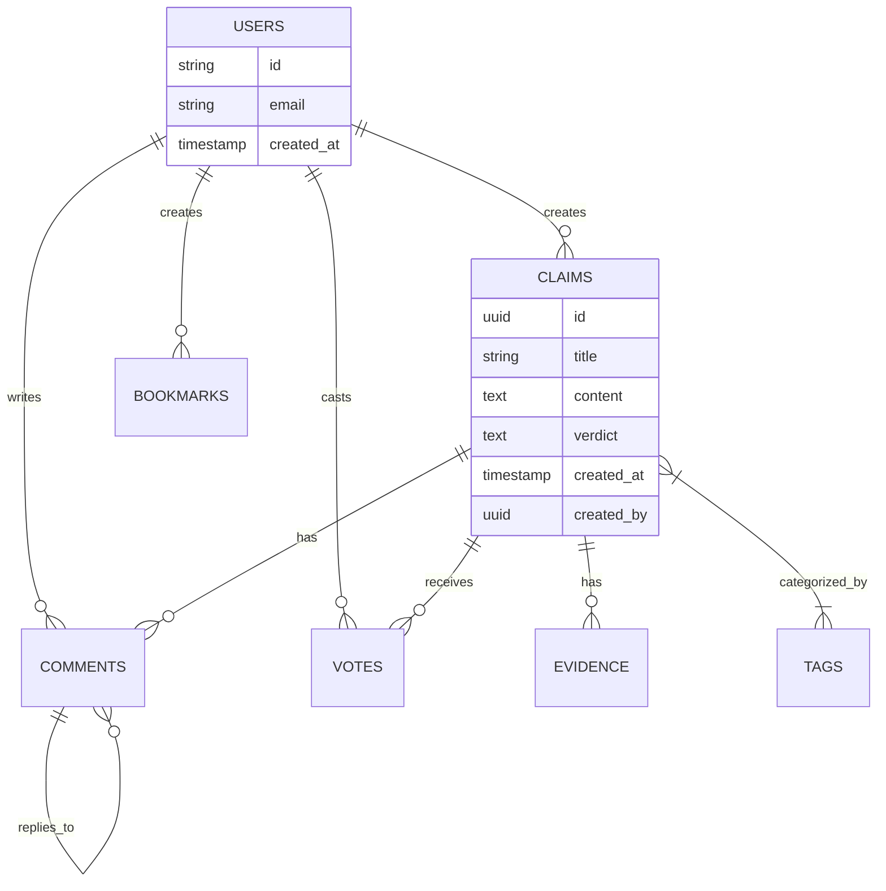

# Database Schema Documentation

## Overview
This document describes the database schema for the Satyasodhak fact-checking platform. The database uses PostgreSQL with Supabase and follows a relational model with proper constraints and relationships.

## Tables

### 1. `claims`
Stores all fact-checking claims.

| Column | Type | Description |
|--------|------|-------------|
| `id` | UUID (PK) | Unique identifier |
| `title` | TEXT | Title of the claim |
| `content` | TEXT | Full content/description |
| `summary` | TEXT | Brief summary |
| `verdict` | TEXT | One of: 'true', 'false', 'misleading', 'unverified', 'pending' |
| `source_url` | TEXT | URL of the original claim |
| `created_at` | TIMESTAMPTZ | Creation timestamp |
| `updated_at` | TIMESTAMPTZ | Last update timestamp |
| `created_by` | UUID (FK) | Reference to auth.users |
| `is_public` | BOOLEAN | Visibility flag |
| `metadata` | JSONB | Additional metadata |
| `search_vector` | TSVECTOR | For full-text search |

**Indexes:**
- Primary key on `id`
- Indexes on `verdict`, `created_at`, `created_by`
- GIN index on `search_vector`

### 2. `tags`
Categories for claims.

| Column | Type | Description |
|--------|------|-------------|
| `id` | SERIAL (PK) | Auto-incrementing ID |
| `name` | TEXT (UNIQUE) | Tag name |
| `description` | TEXT | Tag description |
| `created_at` | TIMESTAMPTZ | Creation timestamp |

### 3. `claim_tags`
Junction table for many-to-many relationship between claims and tags.

| Column | Type | Description |
|--------|------|-------------|
| `claim_id` | UUID (FK) | Reference to claims.id |
| `tag_id` | INTEGER (FK) | Reference to tags.id |

**Primary Key:** (`claim_id`, `tag_id`)

### 4. `evidence`
Supporting evidence for claims.

| Column | Type | Description |
|--------|------|-------------|
| `id` | UUID (PK) | Unique identifier |
| `claim_id` | UUID (FK) | Reference to claims.id |
| `content` | TEXT | Evidence content |
| `source_url` | TEXT | Source URL |
| `is_supporting` | BOOLEAN | Whether evidence supports the claim |
| `created_at` | TIMESTAMPTZ | Creation timestamp |
| `created_by` | UUID (FK) | Reference to auth.users |
| `metadata` | JSONB | Additional metadata |

**Indexes:**
- Primary key on `id`
- Indexes on `claim_id`, `created_at`

### 5. `profiles`
Extended user profiles.

| Column | Type | Description |
|--------|------|-------------|
| `id` | UUID (PK, FK) | Reference to auth.users |
| `username` | TEXT (UNIQUE) | Username |
| `full_name` | TEXT | User's full name |
| `avatar_url` | TEXT | Profile picture URL |
| `bio` | TEXT | User biography |
| `website` | TEXT | Personal website |
| `created_at` | TIMESTAMPTZ | Creation timestamp |
| `updated_at` | TIMESTAMPTZ | Last update timestamp |

### 6. `comments`
User comments on claims.

| Column | Type | Description |
|--------|------|-------------|
| `id` | UUID (PK) | Unique identifier |
| `claim_id` | UUID (FK) | Reference to claims.id |
| `user_id` | UUID (FK) | Reference to auth.users |
| `content` | TEXT | Comment text |
| `parent_id` | UUID (FK) | For nested comments |
| `created_at` | TIMESTAMPTZ | Creation timestamp |
| `updated_at` | TIMESTAMPTZ | Last update timestamp |

**Indexes:**
- Primary key on `id`
- Indexes on `claim_id`, `user_id`, `created_at`

### 7. `votes`
User votes on claims.

| Column | Type | Description |
|--------|------|-------------|
| `id` | UUID (PK) | Unique identifier |
| `claim_id` | UUID (FK) | Reference to claims.id |
| `user_id` | UUID (FK) | Reference to auth.users |
| `vote_value` | INTEGER | -1 (downvote), 0 (no vote), 1 (upvote) |
| `created_at` | TIMESTAMPTZ | Creation timestamp |
| `updated_at` | TIMESTAMPTZ | Last update timestamp |

**Constraints:**
- Unique on (`claim_id`, `user_id`)
- Check constraint on `vote_value` (-1, 0, 1)

### 8. `bookmarks`
User bookmarks for claims.

| Column | Type | Description |
|--------|------|-------------|
| `id` | UUID (PK) | Unique identifier |
| `claim_id` | UUID (FK) | Reference to claims.id |
| `user_id` | UUID (FK) | Reference to auth.users |
| `created_at` | TIMESTAMPTZ | Creation timestamp |

**Constraints:**
- Unique on (`claim_id`, `user_id`)

## Relationships



## Common Queries

### Get Claims with Tags
```sql
SELECT 
    c.*,
    COALESCE(
        (SELECT json_agg(t.*) 
         FROM tags t 
         JOIN claim_tags ct ON t.id = ct.tag_id 
         WHERE ct.claim_id = c.id),
        '[]'::json
    ) as tags
FROM claims c
ORDER BY c.created_at DESC;
```

### Get Claim with Full Details
```sql
SELECT 
    c.*,
    (SELECT row_to_json(u) FROM (SELECT id, email FROM auth.users WHERE id = c.created_by) u) as author,
    COALESCE(
        (SELECT json_agg(json_build_object(
            'id', e.id,
            'content', e.content,
            'is_supporting', e.is_supporting,
            'created_at', e.created_at
        ))
        FROM evidence e 
        WHERE e.claim_id = c.id
        GROUP BY e.claim_id),
        '[]'::json
    ) as evidence,
    COALESCE(
        (SELECT json_agg(json_build_object(
            'id', t.id,
            'name', t.name
        ))
        FROM tags t 
        JOIN claim_tags ct ON t.id = ct.tag_id 
        WHERE ct.claim_id = c.id
        GROUP BY ct.claim_id),
        '[]'::json
    ) as tags
FROM claims c
WHERE c.id = $1;
```

### Search Claims
```sql
SELECT 
    c.*,
    ts_rank(c.search_vector, websearch_to_tsquery('english', $1)) as rank
FROM claims c
WHERE c.search_vector @@ websearch_to_tsquery('english', $1)
ORDER BY rank DESC, c.created_at DESC;
```

## Row Level Security (RLS) Policies

### Claims
- **Select**: Anyone can view claims
- **Insert**: Authenticated users can create claims
- **Update**: Users can only update their own claims
- **Delete**: Users can only delete their own claims

### Evidence
- **Select**: Anyone can view evidence
- **Insert**: Authenticated users can add evidence
- **Update**: Users can only update their own evidence
- **Delete**: Users can only delete their own evidence

### Comments
- **Select**: Anyone can view comments
- **Insert**: Authenticated users can comment
- **Update**: Users can only update their own comments
- **Delete**: Users can only delete their own comments

### Votes
- **Select**: Users can view their own votes
- **Insert/Update**: Users can only modify their own votes

## Maintenance

### Adding a New Tag
```sql
INSERT INTO tags (name, description) 
VALUES ('new_category', 'Description of the new category')
ON CONFLICT (name) DO NOTHING;
```

### Updating Search Index
```sql
-- Update the search vector for all claims
UPDATE claims 
SET search_vector = 
    setweight(to_tsvector('english', COALESCE(title, '')), 'A') ||
    setweight(to_tsvector('english', COALESCE(content, '')), 'B') ||
    setweight(to_tsvector('english', COALESCE(summary, '')), 'C');
```

## Version History
- **2025-11-08**: Initial schema created

---
*This document is auto-generated. Please update it when making schema changes.*
